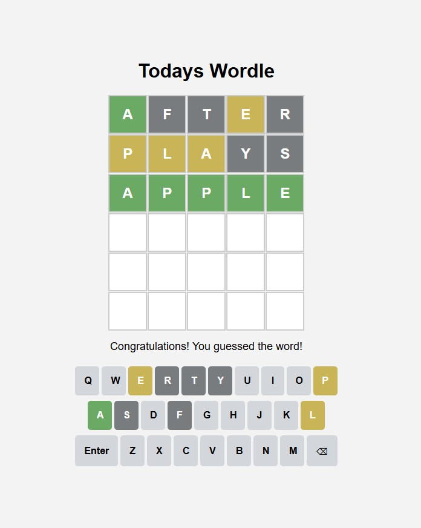

# Custom Wordle Game

A customizable Wordle game that you can set your own word via a URL parameter and share it with your friends.

## Features

- **In-App Keyboard**: Fully functional on-screen keyboard for mobile and desktop.
- **Color-Coded Feedback**: Letters are highlighted based on correctness:
  - 🟩 Green: Correct letter in the correct position.
  - 🟨 Yellow: Correct letter in the wrong position.
  - ⬛ Gray: Letter not in the word.
- **Custom Word**: Set the target word via a URL parameter (e.g., `?w=APPLE`).
  - Because we don't want your friends to be able to know the word from the URL we do a simple encryption.
  - For example if you want the word to be APPLE the input word in the URL should be A+1 P+2 P+3 L+4 E+5 = BRSPJ
  - So the URL for wordle with word APPLE would be https://brandondsz.github.io/Wordle/?w=BRSPJ
  - If you dont provide a word in the URL we will pick a random word for you. Try it - https://brandondsz.github.io/Wordle
